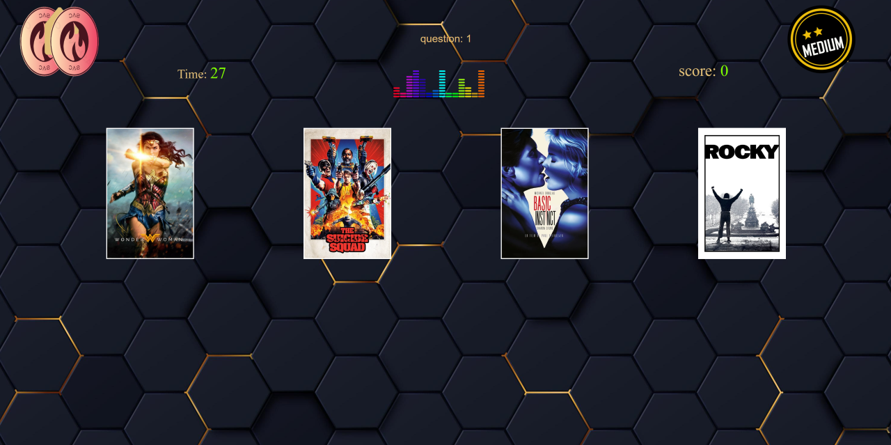

# BlinTestSac

This project was generated with [Angular CLI](https://github.com/angular/angular-cli) version 15.0.4.

## Summary:

This project is a site offering blind questionnaires on the themes of film music.
Offering 3 levels of difficulty based on 3 tables of questions and using the dbMovies and Deezer APIs.

Project done in partnership with Stephane B. (StefLolo38), Cyril D. (Cyril6978), and Adrien C. (Coducteur) for wildCodeSchool, February 2023

## Screenshots:

## Responsives Screenshots:

